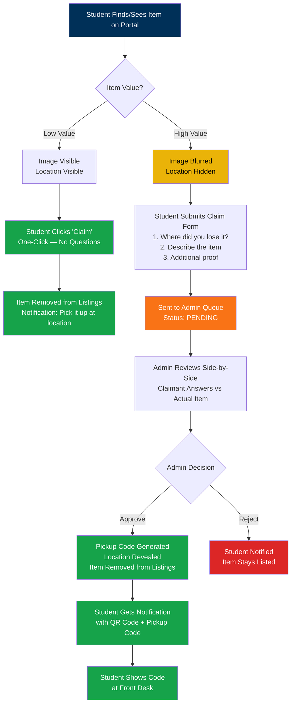

# Secure Claim System Flowchart

Paste the code below into https://mermaid.live to render it as an image.

```mermaid
flowchart TD
    A[Student Finds/Sees Item on Portal] --> B{Item Value?}

    B -->|Low Value| C[Image Visible\nLocation Visible]
    B -->|High Value| D[Image Blurred\nLocation Hidden]

    C --> E[Student Clicks 'Claim'\nOne-Click — No Questions]
    D --> F[Student Submits Claim Form\n1. Where did you lose it?\n2. Describe the item\n3. Additional proof]

    E --> G[Item Removed from Listings\nNotification: Pick it up at location]

    F --> H[Sent to Admin Queue\nStatus: PENDING]

    H --> I[Admin Reviews Side-by-Side\nClaimant Answers vs Actual Item]

    I --> J{Admin Decision}

    J -->|Approve| K[Pickup Code Generated\nLocation Revealed\nItem Removed from Listings]
    J -->|Reject| L[Student Notified\nItem Stays Listed]

    K --> M[Student Gets Notification\nwith QR Code + Pickup Code]
    M --> N[Student Shows Code\nat Front Desk]

    style A fill:#003058,color:#fff
    style D fill:#EAB308,color:#000
    style E fill:#16A34A,color:#fff
    style G fill:#16A34A,color:#fff
    style H fill:#F97316,color:#fff
    style K fill:#16A34A,color:#fff
    style L fill:#DC2626,color:#fff
    style M fill:#16A34A,color:#fff
    style N fill:#16A34A,color:#fff
```
